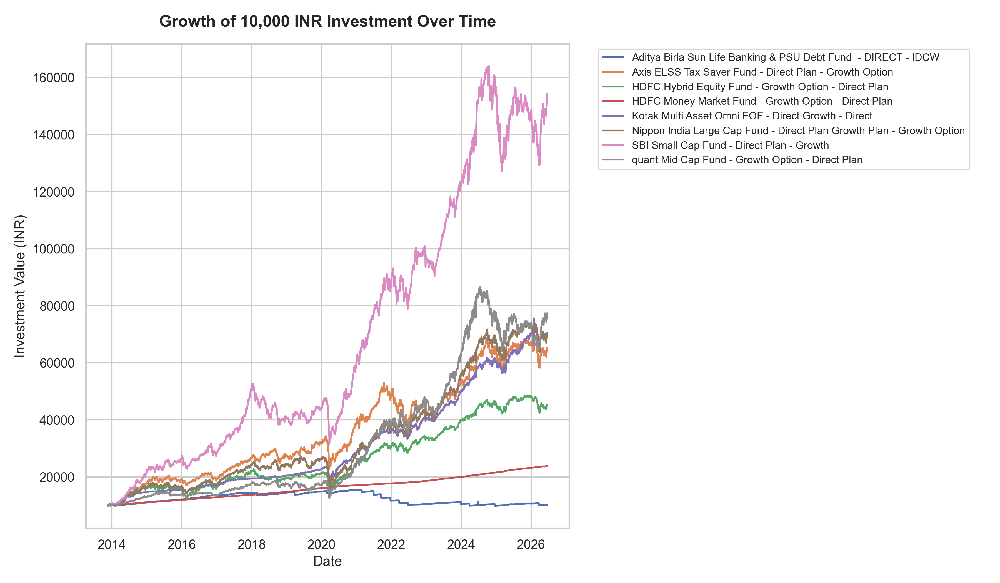
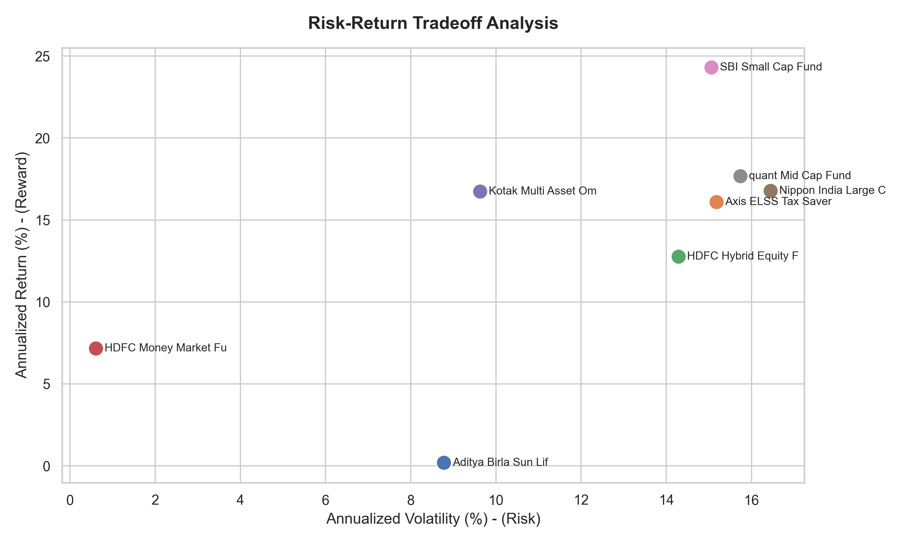

# Mutual Fund Portfolio Analysis Report

This report provides a financial analysis of the historical Net Asset Value (NAV) performance, risk metrics, and drawdowns for the ingested mutual fund schemes.

## 1. Executive Performance Metrics Table

| Scheme Name | Cumulative Return | Annualized Return | Annualized Volatility | Sharpe Ratio | Max Drawdown |
| --- | --- | --- | --- | --- | --- |
| Aditya Birla Sun Life Banking & PSU Debt Fund  - DIRECT - IDCW | 2.44% | 0.19% | 8.78% | -0.62 | -36.65% |
| Axis ELSS Tax Saver Fund - Direct Plan - Growth Option | 553.43% | 16.09% | 15.18% | 0.66 | -33.51% |
| HDFC Hybrid Equity Fund - Growth Option - Direct Plan | 353.02% | 12.76% | 14.29% | 0.49 | -33.56% |
| HDFC Money Market Fund - Growth Option - Direct Plan | 138.86% | 7.16% | 0.61% | 1.51 | -1.39% |
| Kotak Multi Asset Omni FOF - Direct Growth - Direct | 600.2% | 16.73% | 9.63% | 1.03 | -22.83% |
| Nippon India Large Cap Fund - Direct Plan Growth Plan - Growth Option | 603.65% | 16.77% | 16.45% | 0.66 | -39.96% |
| SBI Small Cap Fund - Direct Plan - Growth | 1443.81% | 24.3% | 15.06% | 1.12 | -40.26% |
| quant Mid Cap Fund - Growth Option - Direct Plan | 674.66% | 17.67% | 15.74% | 0.73 | -33.43% |

## 2. Investment Growth Visualisation

The chart below illustrates the growth of an initial investment of 10,000 INR across all funds based on daily historical NAV data.

## 3. Risk-Reward Tradeoff Analysis

The chart below shows the risk (annualized volatility) vs. reward (annualized returns) of the funds. In general, higher returns are expected to carry higher risk (volatility).

## 4. Key Financial Observations

- **Highest Performing Scheme:** SBI Small Cap Fund - Direct Plan - Growth with an annualized return of 24.3%.
- **Lowest Volatility (Safest) Scheme:** HDFC Money Market Fund - Growth Option - Direct Plan with an annualized volatility of 0.61%.
- **Best Risk-Adjusted Returns (Highest Sharpe Ratio):** HDFC Money Market Fund - Growth Option - Direct Plan with a Sharpe ratio of 1.51.
- **Worst Peak-to-Trough Decline (Max Drawdown):** SBI Small Cap Fund - Direct Plan - Growth with a drawdown of -40.26%.
